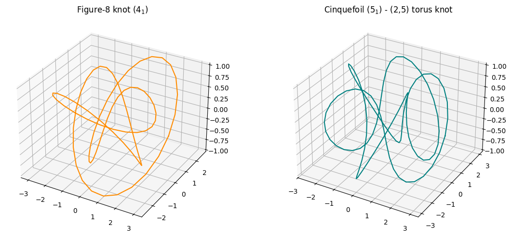
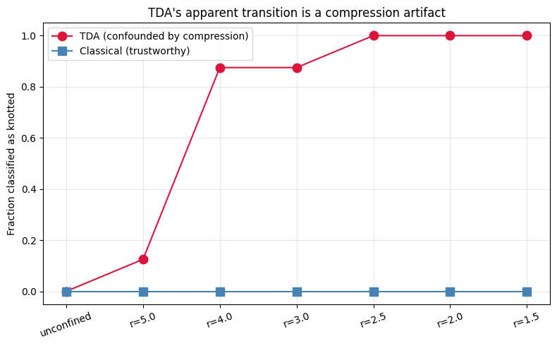

# DNA Knots

A DNA polymer simulator paired with two independent knot classifiers — one
classical (Alexander polynomial), one topological (persistent homology) — used together to
study how confinement affects knotting. 

<p align="center">
 
 
</p>

A first-pass analysis using only a topological classifier suggested a
confinement-induced knotting transition. Cross-validating against a
provably-correct classical classifier revealed this was almost entirely a geometric artifact of
compression, and not genuine knotting. See [notebook 5](notebooks/05_confinement_study.ipynb) for
the full investigation.

## Background

Do DNA knots actually form? Electron microscopy has visualized knotted DNA. Bacteriophages pack their genome into a capsid at extraordinary density. [Arsuaga et al.](https://www.pnas.org/doi/10.1073/pnas.032095099) extracted phage P4 DNA and found that it was highly knotted. Knot complexity scaled with how tightly it had been packed. In 1988, [Sumners and Whittington](https://iopscience.iop.org/article/10.1088/0305-4470/21/7/030) proved that as a self-avoiding polymer chain gets longer, the probability that it is knotted approaches 100\% exponentially. 

Knotting causes sister chromosomes to break or improperly separate, causing aneuploidy. It also blocks the machinery that reads and copies DNA. Topoisomerases thus evolved to pass DNA strands through each other to remove knots and supercoils. In fact, Type II topoisomerases actively simplify knots below what thermodynamic equilibrium would predict [Rybenkov et al.](https://www.science.org/doi/10.1126/science.277.5326.690). Healthy cells actively use energy to fight knotting. Topoisomerases are a major drug target. Several important drug classes (chemotherapy drugs, fluoroquinolone antibiotics) work by trapping the enzyme mid-strand-passage to cause irreparable DNA damage. Understanding how knots form and get resolved is relevant to how these drugs work and how resistance to them develops. 

Confinement, the knotting parameter explored in this project, models the following biological situations:
- Genomes packed at extreme density in viral capsids
- The human genome, which has about has about 2m of DNA packed in a 10 micrometer cell nucleus

## Contents

- [Repo structure](#repo-structure)
- [What's in each notebook](#whats-in-each-notebook)
- [Setup](#setup)
- [Key results](#key-results)
- [Scope & limitations](#scope--limitations)
- [Future work](#future-work)
- [References](#references)

## Repo structure

```
topological-dna-knots/
├── README.md
├── requirements.txt
├── LICENSE
├── .gitignore
├── notebooks/
│   ├── 01_polymer_simulator.ipynb         Langevin dynamics bead-spring DNA simulator
│   ├── 02_classical_knot_classifier.ipynb KMT simplification + Alexander polynomial
│   ├── 03_tda_knot_classifier.ipynb       persistent homology knot classifier
│   ├── 04_broader_validation.ipynb        multiple knot types 
│   └── 05_confinement_study.ipynb         the confinement study 
│   └── 06_ml_knot_classifier.ipynb        persistence images + ML for knot type
├── src/
│   ├── dnasim.py                          simulation physics (forces, integrator)
│   ├── knotclassify.py                    classical classifier (KMT + Alexander polynomial)
│   └── tdaknot.py                         TDA classifier (persistent homology)
├── data/
│   └── confinement_sweep_results.json     raw numbers behind notebook 5's summary chart
└── docs/
    └── images/                            result figures used in this README
```

**No external dataset needed anywhere in this repo.** Every notebook generates its own test
configurations (rings, analytic torus-knot/figure-8 parametrizations, simulated trajectories).
Clone and run, no downloads.

## What's in each notebook

| Notebook | What it does | Key result |
|---|---|---|
| `01` | Coarse-grained bead-spring DNA (FENE bonds, WCA excluded volume, Kratky-Porod bending, optional confinement) under overdamped Langevin dynamics. Every force verified against a finite-difference gradient of its own energy before trusting any simulation. | Found & fixed 2 real force-derivation bugs (FENE, bending) during verification |
| `02` | KMT geometric polygon simplification (topology-preserving by construction) + Alexander polynomial via the matrix method | Exact match to the literature-known trefoil polynomial, cross-checked against 2 independent parametrizations |
| `03` | A second, independent classifier via persistent homology on the full pairwise 3D distance matrix  | Clean separation (unknot → 1 feature, trefoil → >1, 16/16 test cases) and full agreement with the classical method across an entire simulated relaxation trajectory. |
| `04` | Extends validation to the figure-8 and cinquefoil knots. | Bug found and root-caused via brute-force testing against literature values, fixed, fully re-validated |
| `05` | Does confinement increase knotting probability? | TDA-only showed a transition: cross-validation revealed it was a confinement-compression artifact. The trustworthy classical result: genuine spontaneous knotting doesn't occur in this simulation's accessible regime, regardless of confinement strength |
| `06` | Extends TDA past knotted-vs-unknotted: vectorizes full persistence diagrams (persistence images) and trains a classifier to distinguish knot type | 100\% accuracy on its own held-out augmented test set, but misclassified a simulated trefoil trajectory as a cinquefoil when tested beyond the augmentation distribution |

## Setup

```bash
git clone https://github.com/YOUR_USERNAME/topological-dna-knots.git
cd topological-dna-knots
pip install -r requirements.txt
jupyter notebook notebooks/01_polymer_simulator.ipynb
```

Every notebook runs standalone, top to bottom, with zero setup. No data downloads, no
external files. Notebooks 2-5 build on `src/`'s modules; `sys.path` handling is already set up
in each notebook's first cells.

## Key results

**Two real bugs found and fixed by verification:**
- Two force-derivation errors in the physics simulator (notebook 1), caught by checking every
  analytic force against a finite-difference gradient of its own energy before trusting any
  simulation output.
- A wrong Alexander-matrix coefficient table (notebook 4), which gave correct answers for the
  trefoil purely by chance. Its symmetric structure doesn't discriminate between multiple
  candidate (mostly wrong) tables. Only exposed by testing against knot types with less
  symmetric crossing structure (figure-8, cinquefoil).

**Methodological Insight:** notebook 5's confinement
study initially looked like a confirmation of the literature (confinement
increases knotting probability). Cross-validating the fast topological classifier against the
slower but provably-correct classical one revealed the "transition" was almost entirely a
compression artifact. The topological method can't distinguish genuine self-threading from
simple geometric compression, since both bring distant-along-the-strand points close together
in 3D space. 

**Generalization Insight:** notebook 6's ML knot-type classifier
scored 100\% on its own held-out test set, but misclassified a simulated trefoil
trajectory as a cinquefoil once tested on real physics output rather than more augmented copies
of its own training curves. 

## Scope & limitations

- TDA knot classifier (notebook 3) is validated for unconfined configurations only, and 
  notebook 5 shows it gives false positives under confinement. Treat it as a fast complementary
  sanity check alongside the classical method, not a standalone classifier, especially for
  compact/confined geometries.
- The TDA classifier distinguishes knotted-vs-unknotted, not knot type. It hasn't been
  tested against distinguishing, say, a trefoil from a figure-8, and there's no theoretical
  reason to expect the raw feature count to do so reliably.
- The classical classifier's non-minimal-diagram edge case (documented in notebook 2):
  correctness is verified for minimal-crossing diagrams; a non-minimal diagram occasionally
  gives a wrong answer for reasons not yet isolated. Mitigated throughout by searching
  many random projections and keeping the minimal-crossing one found.
- Confinement study sample sizes are modest (8 replicates per condition) given the compute
  budget available 
- The ML knot-type classifier (notebook 6) does not currently generalize. Treat it as a working pipeline demonstration, not a trustworthy classifier.

## Future work

- Longer chains (200-500+ beads) and longer simulation runs 
- Seed a small pre-existing knot in a chain and study confinement's effect on its *stability/persistence*, rather than
  *de novo* spontaneous formation 
- A compression- or confinement-robust TDA method (e.g. normalizing the distance matrix by local density, or
  using a fixed physical distance scale on the Rips complex rather than one relative to the chain's overall extent).
- Extend the classical classifier past the non-minimal-diagram edge case noted above.
- Fix notebook 6's generalization failure by training on many simulated trajectories per
  knot type instead of geometric augmentations of one fixed analytic curve per class. Re-run the section E generalization check with a real sample size rather than 2 examples.

## References

- Adams, C. (1994). *The knot book.* American Mathematical Soc.
- Alexander, J.W. (1928). *Topological invariants of knots and links.* Transactions of the AMS.
- Koniaris, K., Muthukumar, M. (1991). *Self-entanglement in ring polymers.* J. Chem. Phys.
- Landuzzi, F. et al. (2020). *Persistence Homology of
  Entangled Rings.* Phys. Rev. Research 
  - Celoria, D. et al. (2021). *A statistical approach to knot confinement via persistent
  homology.* Proc. R. Soc.
- Janse van Rensburg, E.J. et al. (2025). *Relative knot probabilities in confined lattice polygons.* Phys. Rev. E
- Sleiman, J. et al. (2023). *Geometric learning of knot topology.* Soft Matter.
- Adams, H. et al. (2017). *Persistence Images: A Stable Vector Representation of Persistent Homology.* Journal of Machine Learning Research.
- Bubenik, P. (2015). *Statistical Topological Data Analysis using Persistence Landscapes*. Journal of Machine Learning Research.